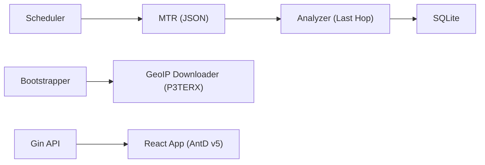

```
██████╗  ██████╗ ██╗   ██╗████████╗███████╗██╗     ███████╗███╗   ██╗███████╗
██╔══██╗██╔═══██╗██║   ██║╚══██╔══╝██╔════╝██║     ██╔════╝████╗  ██║██╔════╝
██████╔╝██║   ██║██║   ██║   ██║   █████╗  ██║     █████╗  ██╔██╗ ██║███████╗
██╔══██╗██║   ██║██║   ██║   ██║   ██╔══╝  ██║     ██╔══╝  ██║╚██╗██║╚════██║
██████╔╝╚██████╔╝╚██████╔╝   ██║   ███████╗███████╗███████╗██║ ╚████║███████║
╚═════╝  ╚═════╝  ╚═════╝    ╚═╝   ╚══════╝╚══════╝╚══════╝╚═╝  ╚═══╝╚══════╝
```

[🇨🇳 中文文档](README_CN.md)

# 🛰️ RouteLens

[](https://goreportcard.com/report/github.com/yuanweize/RouteLens)
[](https://opensource.org/licenses/MIT)
[](https://github.com/yuanweize/RouteLens/releases)
[](https://github.com/yuanweize/RouteLens/pkgs/container/routelens)

---

## Introduction

RouteLens is a modern, agentless network observability platform that traces paths, measures latency/loss/bandwidth, and visualizes routes end-to-end.

## ✨ Features

- 🌍 **Auto GeoIP Injection**: GeoIP is downloaded automatically from the P3TERX mirror and injected into hop data.
- ⚡ **True Latency Mode**: MTR last-hop analysis ensures accurate target latency and loss.
- 🎨 **Modern UI**: Ant Design v5 with a dark mode algorithm.
- 📊 **Historical Metrics**: Time-series trend charts for latency, loss, and speed.
- 📦 **Single Binary**: One-file deployment with systemd support.

## 🛠 Architecture



## 🚀 Quick Start

### Binary Install (Recommended)

```bash
wget https://github.com/yuanweize/RouteLens/releases/latest/download/routelens_linux
chmod +x routelens_linux
./routelens_linux service install --port 8080
```

Open `http://localhost:8080` → `/setup` to initialize admin. GeoIP will be downloaded automatically on first run.

### Docker Compose

```yaml
version: '3.8'
services:
  routelens:
    image: ghcr.io/yuanweize/routelens:latest
    container_name: routelens
    cap_add:
      - NET_RAW
    ports:
      - "8080:8080"
    volumes:
      - ./data:/data
    restart: unless-stopped
```

## ⚙️ Configuration

| Env | Description | Default |
| --- | --- | --- |
| RS_PORT | HTTP port (alias) | 8080 |
| RS_HTTP_PORT | HTTP bind address | :8080 |
| RS_DB_PATH | SQLite path | ./data/routelens.db |
| RS_JWT_SECRET | JWT secret | auto-generated |
| RS_GEOIP_PATH | GeoIP dir | ./data/geoip |
| RS_GEOIP_CITY_DB | GeoIP City DB | empty |
| RS_GEOIP_ISP_DB | GeoIP ISP DB | empty |
| RS_PROBE_INTERVAL | Probe interval (seconds) | 30 |

## 📂 Directory Structure

```
.
├── cmd/          # Entrypoints
├── internal/     # API, monitor, auth
├── pkg/          # Prober, storage, geoip
└── web/          # React frontend (Vite)
```

## License

MIT. See [LICENSE](LICENSE).
