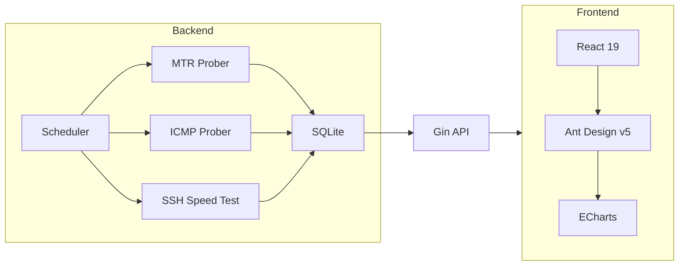

<div align="center">

```
██████╗  ██████╗ ██╗   ██╗████████╗███████╗██╗     ███████╗███╗   ██╗███████╗
██╔══██╗██╔═══██╗██║   ██║╚══██╔══╝██╔════╝██║     ██╔════╝████╗  ██║██╔════╝
██████╔╝██║   ██║██║   ██║   ██║   █████╗  ██║     █████╗  ██╔██╗ ██║███████╗
██╔══██╗██║   ██║██║   ██║   ██║   ██╔══╝  ██║     ██╔══╝  ██║╚██╗██║╚════██║
██████╔╝╚██████╔╝╚██████╔╝   ██║   ███████╗███████╗███████╗██║ ╚████║███████║
╚═════╝  ╚═════╝  ╚═════╝    ╚═╝   ╚══════╝╚══════╝╚══════╝╚═╝  ╚═══╝╚══════╝
```

**Modern, Agentless Network Observability Platform**

*Trace routes • Measure latency • Visualize paths — all from a single binary*

[](https://goreportcard.com/report/github.com/yuanweize/RouteLens)
[](https://opensource.org/licenses/MIT)
[](https://github.com/yuanweize/RouteLens/releases/latest)
[](https://github.com/yuanweize/RouteLens/actions)
[](https://github.com/yuanweize/RouteLens/pkgs/container/routelens)

[🇨🇳 中文文档](README_CN.md)

</div>

---

## ✨ Features

| Feature | Description |
|---------|-------------|
| 🛰️ **Agentless Monitoring** | Ping, MTR traceroute, and SSH-based bandwidth testing — no agents required on targets |
| 🔄 **Auto-Update** | One-click in-app upgrade mechanism (AdGuard Home style) |
| 🔐 **Secure by Default** | JWT authentication, login rate limiting (5/min), input sanitization |
| 🎨 **Modern UI** | React 19 + Ant Design v5 with automatic dark mode |
| 🌍 **Auto GeoIP** | Automatic GeoIP database download and hop enrichment |
| 📊 **Historical Metrics** | Time-series charts for latency, packet loss, and bandwidth trends |
| 📦 **Single Binary** | Zero dependencies, one-file deployment with systemd support |
| 🎯 **Target Control** | Enable/disable monitoring targets without deletion |

---

## 🚀 Quick Start

### Option 1: Docker (Recommended)

```bash
docker run -d \
  --name routelens \
  --cap-add NET_RAW \
  --cap-add NET_ADMIN \
  -p 8080:8080 \
  -v $(pwd)/data:/data \
  -e RS_JWT_SECRET=your_secure_secret_here \
  ghcr.io/yuanweize/routelens:latest
```

### Option 2: Docker Compose

```bash
curl -O https://raw.githubusercontent.com/yuanweize/RouteLens/master/compose.yml
docker compose up -d
```

### Option 3: Binary

Download from [Releases](https://github.com/yuanweize/RouteLens/releases/latest):

```bash
# Linux
curl -LO https://github.com/yuanweize/RouteLens/releases/latest/download/routelens_1.3.1_linux_amd64.tar.gz
tar xzf routelens_1.3.1_linux_amd64.tar.gz
chmod +x routelens

# Run directly
./routelens --port 8080

# Or install as systemd service
./routelens service install --port 8080
```

---

## 🔧 Initial Setup

1. Open `http://your-server:8080`
2. You'll be redirected to `/setup` on first run
3. Create your admin account
4. Add monitoring targets in the dashboard
5. GeoIP database downloads automatically on first probe

---

## ⚙️ Configuration

### Environment Variables

| Variable | Description | Default |
|----------|-------------|---------|
| `RS_JWT_SECRET` | **⚠️ Required for production** - JWT signing key | Random (changes on restart) |
| `RS_HTTP_PORT` | HTTP listen address | `:8080` |
| `RS_DB_PATH` | SQLite database path | `./data/routelens.db` |
| `RS_GEOIP_PATH` | GeoIP database directory | `./data/geoip` |
| `RS_PROBE_INTERVAL` | Probe interval in seconds | `30` |
| `RS_LOG_LEVEL` | Log level (debug/info/warn/error) | `info` |

> ⚠️ **Security Note:** In production, always set `RS_JWT_SECRET` to a strong, random value. If not set, a random secret is generated at startup and all sessions will be invalidated on restart.

### Example `.env` file

```env
RS_JWT_SECRET=your-super-secure-random-string-at-least-32-chars
RS_HTTP_PORT=:8080
RS_PROBE_INTERVAL=60
```

---

## 🔄 In-App Updates

RouteLens supports seamless self-updates directly from the web UI:

1. Go to **Settings** → **About & Updates**
2. Click **Check for Updates**
3. If available, click **Install Update**
4. Service restarts automatically with the new version

**Requirements:**
- Process must have write permission to its own binary
- For systemd: service will exit and systemd restarts it

---

## 🛠 Architecture



---

## 📂 Project Structure

```
.
├── cmd/server/       # Application entrypoint
├── internal/
│   ├── api/          # REST API handlers & middleware
│   ├── auth/         # JWT authentication
│   └── monitor/      # Probe scheduler
├── pkg/
│   ├── prober/       # MTR, ICMP, SSH speed test
│   ├── storage/      # SQLite repository
│   └── geoip/        # GeoIP enrichment
└── web/              # React frontend (Vite + TypeScript)
```

---

## 🔐 Security

RouteLens v1.3.1 includes security hardening:

- **JWT Authentication** with cryptographically random secrets
- **Login Rate Limiting** (5 attempts per IP per minute)
- **Input Sanitization** on all probe targets (prevents command injection)

---

## 📝 License

[MIT License](LICENSE) — Free for personal and commercial use.

---

<div align="center">

**[⬆ Back to Top](#)**

Made with ❤️ for network engineers

</div>
