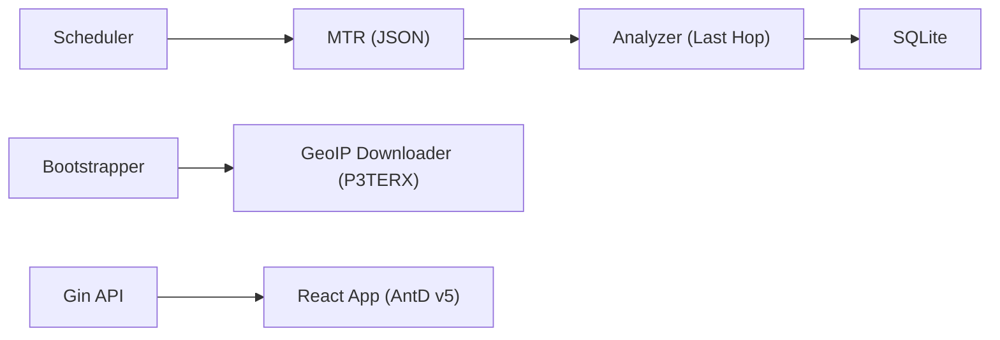

```
██████╗  ██████╗ ██╗   ██╗████████╗███████╗██╗     ███████╗███╗   ██╗███████╗
██╔══██╗██╔═══██╗██║   ██║╚══██╔══╝██╔════╝██║     ██╔════╝████╗  ██║██╔════╝
██████╔╝██║   ██║██║   ██║   ██║   █████╗  ██║     █████╗  ██╔██╗ ██║███████╗
██╔══██╗██║   ██║██║   ██║   ██║   ██╔══╝  ██║     ██╔══╝  ██║╚██╗██║╚════██║
██████╔╝╚██████╔╝╚██████╔╝   ██║   ███████╗███████╗███████╗██║ ╚████║███████║
╚═════╝  ╚═════╝  ╚═════╝    ╚═╝   ╚══════╝╚══════╝╚══════╝╚═╝  ╚═══╝╚══════╝
```

[🇺🇸 English](README.md)

# 🛰️ RouteLens

[](https://goreportcard.com/report/github.com/yuanweize/RouteLens)
[](https://opensource.org/licenses/MIT)
[](https://github.com/yuanweize/RouteLens/releases)
[](https://github.com/yuanweize/RouteLens/pkgs/container/routelens)

---

## 简介

RouteLens 是一款现代化、无 Agent 的网络链路观测平台，覆盖路由追踪、延迟/丢包/带宽测量，并提供可视化地图与历史趋势分析。

## ✨ 功能亮点

- 🌍 **自动 GeoIP 注入**：启动时自动从 P3TERX 镜像下载 GeoIP 并注入链路地理信息。
- ⚡ **真实延迟模式**：MTR 最后一跳分析，保证目标延迟与丢包精准。
- 🎨 **现代化 UI**：Ant Design v5 + Dark Mode Algorithm。
- 📊 **历史指标**：时序曲线展示延迟、丢包与速率。
- 📦 **单文件交付**：一键安装系统服务。

## 🛠 架构图



## 🚀 快速开始

### 二进制安装（推荐）

```bash
wget https://github.com/yuanweize/RouteLens/releases/latest/download/routelens_linux
chmod +x routelens_linux
./routelens_linux service install --port 8080
```

访问 `http://localhost:8080` → `/setup` 完成初始化，首次运行将自动下载 GeoIP。

### Docker Compose

```yaml
version: '3.8'
services:
  routelens:
    image: ghcr.io/yuanweize/routelens:latest
    container_name: routelens
    cap_add:
      - NET_RAW
    ports:
      - "8080:8080"
    volumes:
      - ./data:/data
    restart: unless-stopped
```

## ⚙️ 配置说明

| 环境变量 | 说明 | 默认值 |
| --- | --- | --- |
| RS_PORT | HTTP 端口（别名） | 8080 |
| RS_HTTP_PORT | 监听地址 | :8080 |
| RS_DB_PATH | SQLite 路径 | ./data/routelens.db |
| RS_JWT_SECRET | JWT 密钥 | 自动生成 |
| RS_GEOIP_PATH | GeoIP 目录 | ./data/geoip |
| RS_GEOIP_CITY_DB | GeoIP 城市库 | 空 |
| RS_GEOIP_ISP_DB | GeoIP ISP 库 | 空 |
| RS_PROBE_INTERVAL | 探测间隔（秒） | 30 |

## 📂 项目结构

```
.
├── cmd/          # 入口
├── internal/     # API / 监控 / 鉴权
├── pkg/          # 探测 / 存储 / GeoIP
└── web/          # 前端 (Vite)
```

## License

MIT，详见 [LICENSE](LICENSE)。
